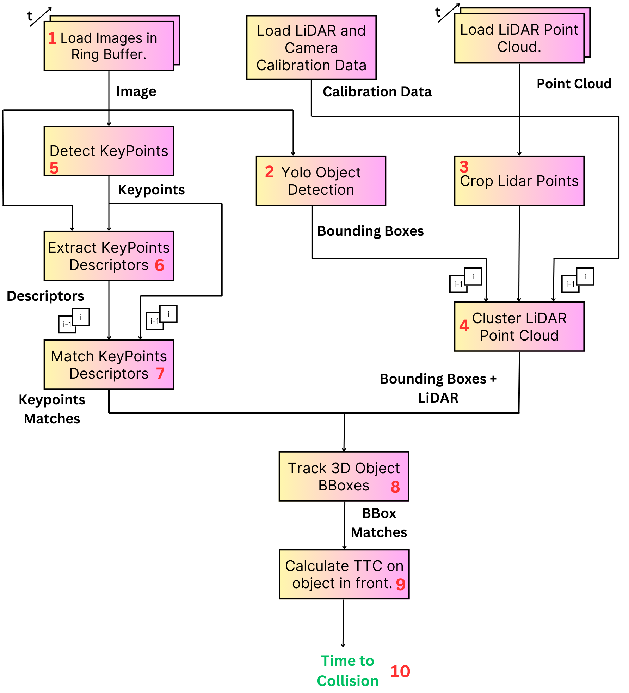

# 3D-Vehicle-Time-To-Collision

This repository is part of the camera course in the Sensor Fusion Nanodegree. In this project, I implemented several key components to track 3D objects over time, compute Time-to-Collision (TTC) using both Lidar and camera data, and test various detector/descriptor combinations.

## Project Overview

This project involves the following tasks:

1. **Matching 3D Objects Over Time**
2. **Computing TTC Based on Lidar Measurements**
3. **Computing TTC Based on Camera Measurements**
4. **Conducting Various Tests with the Framework**

### 1. Matching 3D Objects Over Time

Developed an algorithm to match 3D objects over time using keypoint correspondences. This involved:

- Extracting keypoints and descriptors from successive frames.
- Matching these keypoints to track objects across frames.
- **Implementation Details**: The `matchBoundingBoxes` method in `camFusion_Student.cpp` correctly assigns the matches based on counts. Check out line 285 for implementation details.

### 2. Computing TTC Based on Lidar Measurements

Implemented a method to compute the Time-to-Collision (TTC) using Lidar measurements. This process includes:

- Filtering Lidar points to focus on the region of interest.
- Calculating TTC using the relative velocity and distance of the objects.
- **Implementation Details**: The Lidar-based TTC uses the median distance instead of the closest Lidar point. Check out line 234 in `matching2D_Student.cpp` for implementation.

### 3. Computing TTC Based on Camera Measurements

For camera-based TTC computation:

- Associated keypoint matches to regions of interest (ROI).
- Computed TTC based on the keypoint matches within the ROI.
- Integrated this with the object tracking mechanism.
- **Implementation Details**: 
  - Associate Keypoint Correspondences with Bounding Boxes: Check out line 137 in `matching2D_Student.cpp`.
  - Compute Camera-based TTC: Check out line 175 in `matching2D_Student.cpp`.

### 4. Conducting Various Tests with the Framework

To identify the most suitable detector/descriptor combination for TTC estimation:

- Tested different combinations of detectors (e.g., SIFT, SURF, ORB) and descriptors.
- Analyzed the performance and reliability of these combinations.
- Investigated potential sources of errors from both camera and Lidar sensors.
- **Observations**:
  - The TTC Lidar jumped from 12.515 to 15.74 in one instance, indicating an erroneous prediction due to the constant velocity model assumption. This frame is right after another frame with a significant TTC drop, highlighting the limitations of disregarding acceleration.
  - For my experiments, the SHI TOMASI (detector) + BRISK (descriptor) combination gave stable and reliable results.
  - The Lidar predictions remained constant regardless of the descriptor/detector combination.
  - The ORB + BRIEF combination resulted in a Camera TTC of 130 s.

## Project Structure

- **src/**: Source files for the project, including implementations for keypoint matching, TTC computation, and testing.
- **data/**: Sample data for testing.
- **results/**: Directory to store output results.
- **CMakeLists.txt**: CMake configuration file.
- **README.md**: Project documentation.

## TTC Calculations for Various Detector and Descriptor Combinations

The table below presents Time-to-Collision (TTC) values calculated using different combinations of detectors and descriptors. The TTC values are provided for both Lidar and Camera data across various test scenarios.

| Detector, Descriptor | LidarTTC 1 | CameraTTC 1 | LidarTTC 2 | CameraTTC 2 | LidarTTC 3 | CameraTTC 3 | LidarTTC 4 | CameraTTC 4 | LidarTTC 5 | CameraTTC 5 | LidarTTC 6 | CameraTTC 6 | LidarTTC 7 | CameraTTC 7 | LidarTTC 8 | CameraTTC 8 | LidarTTC 9 | CameraTTC 9 | LidarTTC 10 | CameraTTC 10 | LidarTTC 11 | CameraTTC 11 | LidarTTC 12 | CameraTTC 12 | LidarTTC 13 | CameraTTC 13 |
|----------------------|------------|-------------|------------|-------------|------------|-------------|------------|-------------|------------|-------------|------------|-------------|------------|-------------|------------|-------------|------------|-------------|-------------|--------------|-------------|--------------|-------------|--------------|-------------|--------------|
| HARRIS + BRISK       | 12.5156    | 10.9082     | 12.5156    | 10.9082     | 15.7465    | -inf        | 13.1241    | 12.9162     | 11.1746    | -inf        | 12.8086    | 11.2142     | 8.95978    | 11.6948     | 9.59863    | 5.6061      | 8.52157    | -13.6263    | 9.51552      | 6.33866      | 9.61241      | 12.7384      | 8.3988      | -inf         | -           | -            |
| HARRIS + BRIEF       | 12.5156    | 10.9082     | 12.5156    | 10.9082     | 15.7465    | 34.7543     | 11.9844    | 12.3379     | 13.1241    | 17.6204     | 11.1746    | 20.5862     | 12.8086    | 11.7414     | 8.95978    | nan         | 9.59863    | 5.6061      | 8.52157      | -13.6263     | 9.51552      | 6.6376       | 9.61241      | 12.5848      | 8.3988      | -inf         |
| HARRIS + ORB         | 12.5156    | 10.9082     | 12.5156    | 10.9082     | 15.7465    | 34.7543     | 13.1241    | 17.6204     | 11.1746    | nan         | 12.8086    | 11.2142     | 8.95978    | 11.1055     | 9.59863    | 5.85828     | 8.52157    | -12.639     | 9.51552      | 6.52962      | 9.61241      | 12.5848      | 8.3988      | -inf         | -           | -            |
| HARRIS + FREAK       | 12.5156    | 8.75397     | 15.7465    | 13.3698     | 11.9844    | 11.9596     | 13.1241    | 12.3725     | 11.1746    | 10.2931     | 12.8086    | 11.8135     | 8.95978    | 11.1055     | 9.59863    | nan         | 8.52157    | -25.2781    | 9.51552      | 6.71705      | 9.61241      | 11.1009      | 8.3988      | -inf         | -           | -            |
| SHI-TOMASI + BRISK   | 12.5156    | 12.7951     | 11.9844    | 13.131      | 13.1241    | 13.2469     | 11.1746    | 11.5712     | 12.8086    | 10.9571     | 8.95978    | 12.2294     | 9.59863    | 12.241      | 8.52157    | 9.94433     | 9.51552    | 10.3242     | 9.61241      | 11.3018      | 8.3988       | 9.18809      | -           | -            | -           | -            |
| SHI-TOMASI + BRIEF   | 12.5156    | 14.3846     | 15.7465    | 12.4657     | 11.9844    | 14.0762     | 13.1241    | 12.3758     | 11.1746    | 12.313      | 12.8086    | 11.4293     | 8.95978    | 11.0187     | 9.59863    | 12.5611     | 8.52157    | 12.8981     | 9.51552      | 12.3789      | 9.61241      | 10.7391      | 8.3988      | 8.36986      | -           | -            |
| SHI-TOMASI + ORB     | 12.5156    | 14.685      | 15.7465    | 13.4042     | 11.9844    | 12.5425     | 13.1241    | 13.0058     | 11.1746    | 13.6717     | 12.8086    | 10.7136     | 8.95978    | 12.2398     | 9.59863    | 11.8767     | 8.52157    | 10.2976     | 9.51552      | 12.8765      | 9.61241      | 9.21193      | 8.3988      | 8.29931      | -           | -            |
| SHI-TOMASI + FREAK   | 12.5156    | 13.8833     | 15.7465    | 12.478      | 13.1241    | 11.376      | 11.1746    | 12.6919     | 12.8086    | 11.1985     | 8.95978    | 12.9405     | 9.59863    | 11.5476     | 8.52157    | 11.1223     | 9.51552    | 10.25       | 9.61241      | 12.3667      | 8.3988       | 7.15473      | -           | -            | -           | -            |
| FAST + BRISK         | 12.5156    | 12.5036     | 15.7465    | 76.3058     | 11.9844    | 12.3866     | 13.1241    | 11.342      | 11.1746    | 13.8902     | 12.8086    | 12.2138     | 8.95978    | 11.6041     | 9.59863    | 12.2391     | 8.52157    | 11.4845     | 9.51552      | 12.24        | 9.61241      | 10.0192      | 8.3988      | 12.5199      | -           | -            |
| FAST + BRIEF         | 12.5156    | 10.8342     | 12.5156    | 10.8342     | 15.7465    | 29.241      | 11.9844    | 11.4441     | 13.1241    | 10.873      | 11.1746    | 13.5741     | 12.8086    | 13.7449     | 8.95978    | 10.7982     | 9.59863    | 10.8914     | 8.52157      | 11.0105      | 9.51552      | 11.3321     
